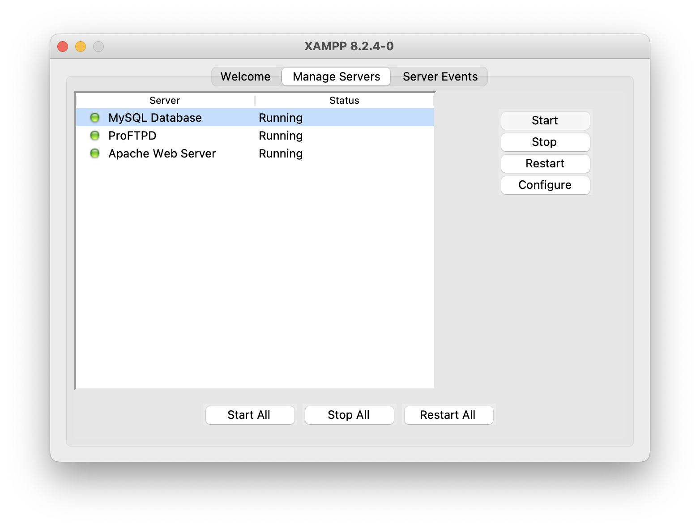
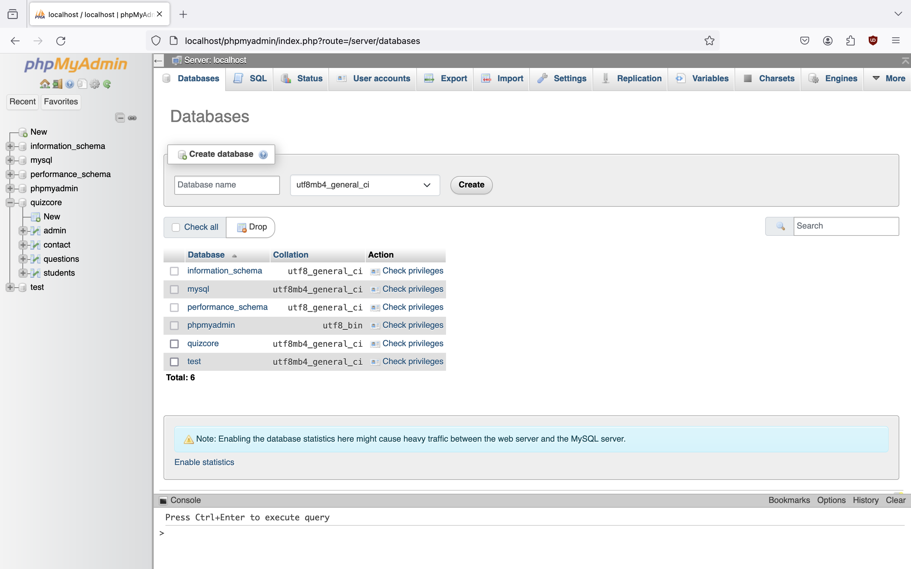

# Introduction

The online self-placement tool assists Central Washington University students in determining the appropriate path to take: CS110 or CS111.

# Technology Stack

* **Backend language:** PHP
* **Database:** MariaDB or MySQL
* **Frontend:** JavaScript, HTML, CSS, Bootstrap

# Run on Localhost

* Download XAMPP: https://www.apachefriends.org/download.html
* Open XAMPP (on MacOS, it's called "manager-osx")
* Click the Start All button in XAMPP

* Open the subfolder "htdocs" in XAMPP and run "git clone https://github.com/quizcore/FinalPresentation/" to clone the repository to the local file system
* Setup the local database
  * Open the browser and go to the URL [http://localhost/phpmyadmin/](http://localhost/phpmyadmin/)
  * Create a new database called "quizcore" (on the right panel)
  * Go to the SQL and paste the SQL code (MySQL_Code.txt) into the text field and click the Go button.

* Student view: Open a browser and go to the URL [http://localhost/FinalPresentation/QuizCore/connection.php](http://localhost/FinalPresentation/QuizCore/connection.php)
* Admin view: Open a browser and go to the URL [http://localhost/FinalPresentation/QuizCore/admin-temp/](http://localhost/FinalPresentation/QuizCore/admin-temp/)

Tip: If your XAMPP database cannot start, there might be other database that takes up that port 3306. Make sure to kill all the processes that take up the port and try to start the XAMPP database again.
For instance, for macos, run `sudo pkill mysqld` to kill mysqld that use the port 3306.

# ROADMAP

## Student

* [X] Make exam "Sign Up" Button Red"
* [X] Conformation Pop up in "Contact Us"
* [X] More Questions in FAQ
* [X] Questions and Answers Sheet
* [X] Get Test answers from the database
* [x] After Signing in to take the test have "User 1" be the name of the student
* [ ] ALEX TASK: For the exams guidelines page refine and put the business side onto the instructions
* [x] Fix the Radio Button on 8,9,15, should be at the top of the question
* [x] Fix Halfway message student should not be able to see the results
* [x] Take away CWU link on halfway so the student wont lose there place in the exam
* [X] Top of the page should not say "Exam Questions 4" but instead say "Exam Questions Set: 4"
* [x] More spacing between Radio buttons and text in the test
* [X] Half-screen bug with radio button on Question 19
* [x] After doing well in both sections the student can test out of both 110 and 111
* [x] Thank you on Last page
* [X] Add a Home buttons / Redirect to other resources on the last page of the exam
* [X] Track date that student took exam
* [X] CS111+ not CS112+ as highest recommendation
* [X] Redesign additional information page, explain each section
* [ ] Add progress bars to other pages

## Admin

* [x] Remove the Header options for Admin
* [X] Red Login Button
* [x] Change "Login as Admin" to "Admin Login"
* [x] Different Admin Header for after sign in
* [X] In user information allow the students information to be search able and only show so many with full screen
* [X] Update admin database connection.
* [ ] Show whether question is correct or incorrect on 'student information' page
* [ ] Bar graph that shows students attending each quarter
* [ ] Fix color in dark mode
* [ ] Put the date the exam was taken onto the screen
* [ ] Add a long cookie session when "remember me" is checked.

## Both

* [X] Add Favicons to all pages

## Low Priority

* [ ] Add admin ability to change Questions and delete items in Database for students
* [ ] Add admin ability to change edit and delete students???
* [ ] Add admin ability to change their profile???
* [ ] Add admin ability to change password???
* [ ] Add admin ability to create new admin account???
